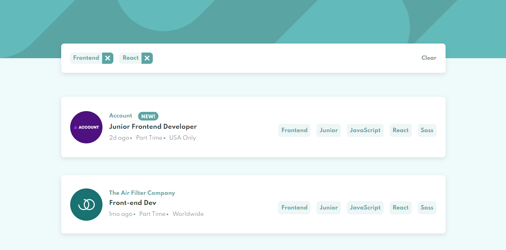

# Frontend Mentor - Job listings with filtering solution

This is a solution to the [Job listings with filtering challenge on Frontend Mentor](https://www.frontendmentor.io/challenges/job-listings-with-filtering-ivstIPCt). Frontend Mentor challenges help you improve your coding skills by building realistic projects. 

## Table of contents

- [Overview](#overview)
  - [The challenge](#the-challenge)
  - [Screenshot](#screenshot)
  - [Links](#links)
- [My process](#my-process)
  - [Built with](#built-with)
  - [What I learned](#what-i-learned)
- [Author](#author)
- [How to use the project](#how-to-use-the-project)

## Overview

### The challenge

Users should be able to:

- View the optimal layout for the site depending on their device's screen size
- See hover states for all interactive elements on the page
- Filter job listings based on the categories

### Screenshot

### Links

- Solution URL: [Github Repository](https://github.com/DanielMafra/job-listings-with-filtering)
- Live Site URL: [Live Demo](https://danielmafra.github.io/job-listings-with-filtering)

## My process

### Built with

- Semantic HTML5 markup
- CSS custom properties
- Flexbox
- CSS Grid
- Mobile-first workflow
- [React](https://reactjs.org/) - JS library

### What I learned

With this challenge, I was able to apply some knowledge related to the use of arrays, such as using map, filter and using the best immutability practices when using the useState hook.

## Author

- Website - [Daniel Mafra](https://danielmafra.github.io)
- Frontend Mentor - [@danielmafra](https://www.frontendmentor.io/profile/DanielMafra)
- LinkedIn - [@danielmafradev](https://linkedin.com/in/danielmafradev)
- Instagram - [@danielmafradev](https://instagram.com/danielmafradev)

## How to use the project

Clone the repository using "git clone". After that use the command "npm install" or "yarn install" to install the dependencies, finally use the command "npm start" or "yarn start" to open the project in the browser.
